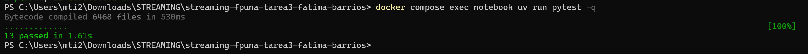
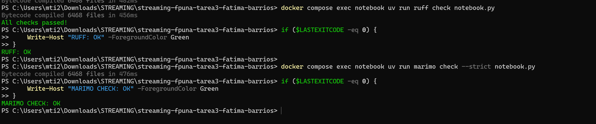
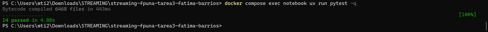

# Pipeline tolerante a desorden y reintentos con Apache Beam

**MIAAD | Facultad Politécnica - UNA**

**Asignatura:** Streaming de datos y sus aplicaciones  
**Tarea 3:** Estado, duplicados e idempotencia con Apache Beam 

**Autor:** Fátima Barrios Ortega

---

## 1. Objetivo

El proyecto implementa un pipeline de pagos con Apache Beam para responder:

> ¿Cuánto se confirmó por comercio y por minuto, sin contar dos veces el mismo pago?

La solución contempla:

- tiempo de evento;
- ventanas fijas;
- eventos fuera de orden y tardíos;
- deduplicación con estado por clave;
- expiración del estado mediante timers;
- triggers y panes acumulativos;
- escritura idempotente frente a reintentos.

---

## 2. Contrato temporal

La política temporal implementada es:

```text
Tiempo utilizado       event_time
Ventana                fija de 60 segundos
Clave                  merchant_id
Filtro                 status == CONFIRMED
Allowed lateness       120 segundos
Trigger early          processing time + 10 segundos
Trigger on-time        watermark cruza window_end
Trigger late           cada nuevo elemento tardío
Acumulación            ACCUMULATING
```

El campo `event_time` se convierte explícitamente en un timestamp de Beam mediante `TimestampedValue`. De este modo, un evento fuera de orden se asigna al minuto en el que ocurrió y no al momento en que fue recibido o procesado.

Cada resultado conserva:

```text
merchant_id
window_start
window_end
total
```

---

## 3. Implementación

Las funciones principales se encuentran en `notebook.py`.

### 3.1 Conversión temporal

`parse_utc` convierte timestamps ISO-8601 terminados en `Z` a objetos `datetime` con zona horaria UTC.

### 3.2 Asignación de ventanas

`assign_fixed_window` calcula intervalos semiabiertos:

```text
[window_start, window_end)
```

Por ejemplo:

```text
13:00:42
→ [13:00:00, 13:01:00)
```

### 3.3 Resumen determinista

`summarize_payments` funciona como referencia determinista de la lógica del pipeline.

Para cada evento registra una auditoría con:

```text
event_id
merchant_id
delay_seconds
duplicate
too_late
accepted
revision
reason
```

Solo se agregan eventos:

- con estado `CONFIRMED`;
- no duplicados;
- recibidos dentro del horizonte de corrección.

### 3.4 Pipeline Beam

`build_windowed_totals_pipeline` utiliza:

```text
Create
→ TimestampedValue
→ Filter
→ FixedWindows
→ clave por merchant_id
→ CombinePerKey
→ WindowParam
```

La agregación se realiza por comercio y por ventana.

---

## 4. Deduplicación con estado

`DeduplicatePayments` es un `DoFn` stateful que mantiene un conjunto de `event_id` observados.

El estado se encuentra aislado por:

```text
merchant_id + ventana
```

Por lo tanto, dos comercios pueden utilizar el mismo `event_id` sin interferir entre sí.

La lógica es:

```text
event_id no observado
→ guardar en estado
→ emitir evento

event_id ya observado
→ no volver a emitir
```

La deduplicación se realiza por identidad lógica del evento y no por el contenido del payload.

---

## 5. Expiración mediante timer

El estado de deduplicación no se conserva indefinidamente.

Al procesar un evento se programa un timer en tiempo de evento para:

```text
window_end + allowed_lateness
```

Cuando el watermark alcanza ese instante, el método `expire` limpia el conjunto de identificadores.

Esto mantiene el estado acotado y evita acumular indefinidamente todos los `event_id` históricos de un comercio.

---

## 6. Triggers y panes

La política de triggers utiliza:

```text
AfterWatermark
├── early: AfterProcessingTime(10)
└── late:  AfterCount(1)
```

Los panes son acumulativos:

```text
ACCUMULATING
```

Esto significa que cada nueva emisión representa el resultado completo actualizado de la ventana.

La política permite:

- una estimación temprana;
- una emisión `ON_TIME` al cruzarse el final de la ventana;
- revisiones `LATE` durante los 120 segundos permitidos.

---

## 7. Idempotencia del sink

La clave idempotente se construye como:

```text
merchant_id|window_start
```

Esta clave identifica el resultado lógico de un comercio en una ventana.

La simulación compara dos comportamientos.

### 7.1 POST append-only

```text
2 intentos
→ 2 filas materializadas
```

### 7.2 UPSERT idempotente

```text
2 intentos con la misma clave
→ 1 entidad materializada
```

Todos los intentos se conservan en la auditoría, pero el estado observable del sink idempotente converge a una sola entidad.

La deduplicación y la idempotencia resuelven problemas distintos:

- la deduplicación evita contar dos veces el mismo pago;
- la idempotencia evita materializar dos veces el mismo resultado.

---

## 8. Pruebas

La suite provista valida:

- parsing UTC;
- ventanas por tiempo de evento;
- eventos fuera de orden;
- duplicados;
- aislamiento del estado por comercio;
- eventos `LATE` aceptados;
- eventos `TOO LATE`;
- agregación por ventana;
- configuración de triggers;
- timers de limpieza;
- reintentos idempotentes;
- comportamiento append-only.

También se agregó:

```text
tests/test_temporal.py
```

Esta prueba utiliza `TestStream` para simular:

1. dos eventos dentro de una ventana;
2. el avance del watermark hasta el final;
3. un evento tardío perteneciente a la misma ventana;
4. una revisión acumulativa del resultado.

Resultado final:

```text
14 passed
```

---

## 9. Trade-offs

### 9.1 Latencia frente a completitud

El trigger temprano reduce la latencia observable, pero genera resultados provisionales y más escrituras downstream.

### 9.2 Allowed lateness

Los 120 segundos permiten corregir resultados ante eventos tardíos, pero requieren conservar el estado durante más tiempo.

### 9.3 Acumulación

Los panes `ACCUMULATING` simplifican el consumo mediante `UPSERT`, aunque cada emisión transporta nuevamente el resultado completo.

### 9.4 Estado

La deduplicación stateful evita duplicados, pero requiere una política explícita de expiración para mantener el consumo de recursos acotado.

### 9.5 Idempotencia

El `UPSERT` protege el efecto observable del sink ante reintentos, pero depende de una clave estable que identifique correctamente el resultado lógico.

---

## 10. Ejecución reproducible

### 10.1 Con Docker

Construir e iniciar Marimo:

```bash
docker compose up --build notebook
```

Abrir:

```text
http://localhost:2718
```

Ejecutar las pruebas:

```bash
docker compose exec notebook uv run pytest -q
```

Validar estilo:

```bash
docker compose exec notebook uv run ruff check notebook.py tests
```

Validar la estructura del notebook:

```bash
docker compose exec notebook uv run marimo check --strict notebook.py
```

### 10.2 Con uv

```bash
uv sync --frozen
uv run marimo edit notebook.py
uv run pytest -q
uv run ruff check notebook.py tests
uv run marimo check --strict notebook.py
```

---

## 11. Evidencias

### Suite provista



### Validaciones de calidad



### Suite ampliada con TestStream



---

## 12. Resultado

La implementación cumple el contrato solicitado:

```text
desorden
→ event_time y ventanas

duplicados
→ estado por clave

crecimiento del estado
→ timer de expiración

resultados parciales
→ triggers y panes acumulativos

reintentos
→ clave idempotente y UPSERT
```

La suite completa y ampliada finaliza con:

```text
14 passed
```
